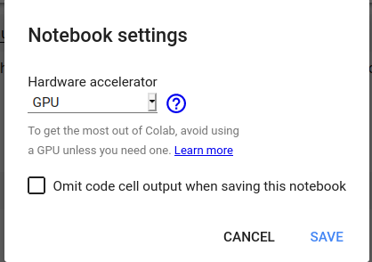
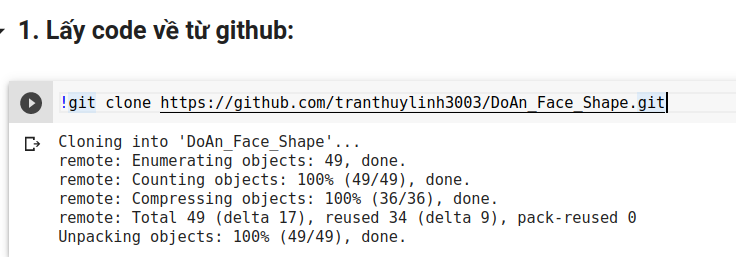
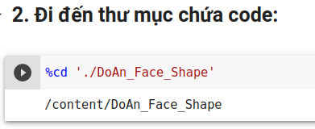
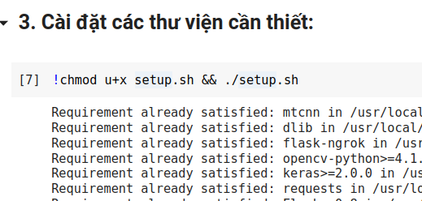
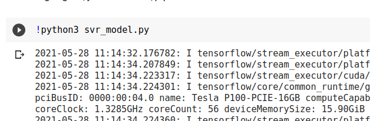
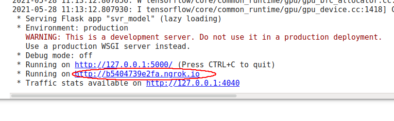

# DoAn_Face_Shape

## Link data:
> ### 1.[Face\_Shape\_Data](./Data/face_shape_data.zip)
>
> ### 2.[shape\_predictor\_68\_face\_landmarks.dat](http://dlib.net/files/shape_predictor_68_face_landmarks.dat.bz2)
>
---

## Cách chạy trên Colab:
- Vì dữ liệu đã được train sẵn rồi nên không cần train lại nữa

### 1. Tạo 1 file Colab:


#### - Nếu muốn chạy nhanh hơn thì vào 
> **Runtime -> Change Runtime type -> GPU**





### 2. Lấy code từ github:
```
!gitclone https://github.com/tranthuylinh3003/DoAn_Face_Shape.git
```


### 3. Đi đến thư mục chứa code:
```
%cd './DoAn_Face_Shape'
```


### 4. Cài đặt các thư viện cần thiết:
```
!chmod u+x setup.sh && ./setup.sh
```


### 5. Run Code:
```
!python3 svr_model.py
```



#### - Trong khi run sẽ xuất hiện:

> **Running on http://xxxxxxx.ngrok.io**

#### - Nhấp vào link để vào trang web.




#### **Ngưng chạy thì bấm tổ hợp phím 'Ctrl + M + I'**

#### Code Colab: [Code tham khảo](https://github.com/tranthuylinh3003/DoAn_Face_Shape/blob/main/Run_App.ipynb)

---

## Tham khảo: [MiAI\_Face\_Shape](https://github.com/thangnch/MiAI_Face_Shape)


